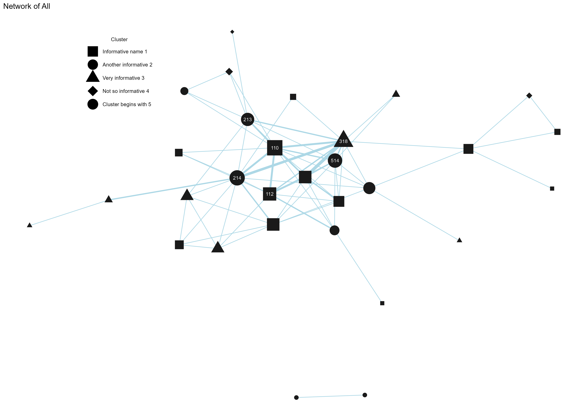

# Network analysis from research data

# TODO:
  add toc
  move to qmd
  work on net statistics
  add structure

# Introduction

This folder contains the required R files as well as xlsx to run the network analysis.
There is still debugging to be done, but the code is functional, and will probably not change much.

# Structure
  - [Input files](input files/)
  - [R files](R files/)
  - [Output files](output files/)

# Plotting the network
Here is an example of the network with all students:

# Statistics
