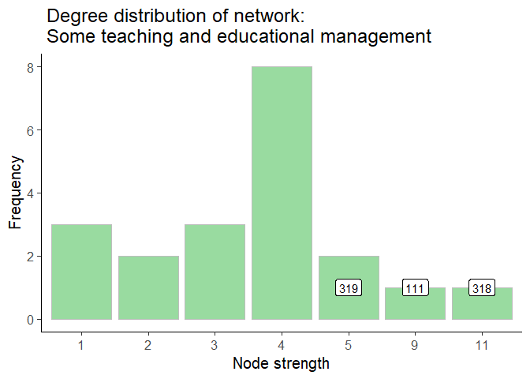
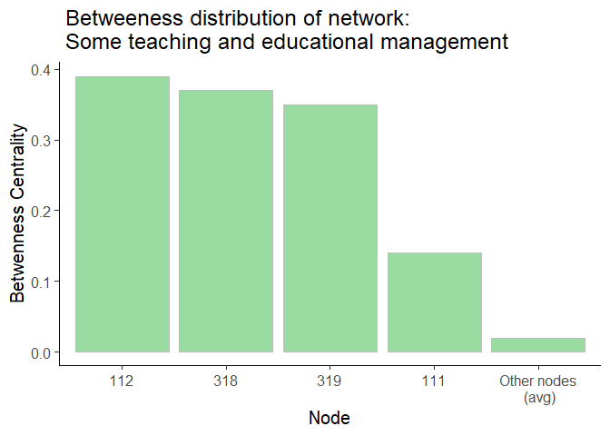
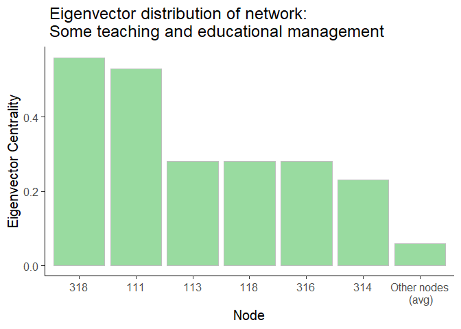
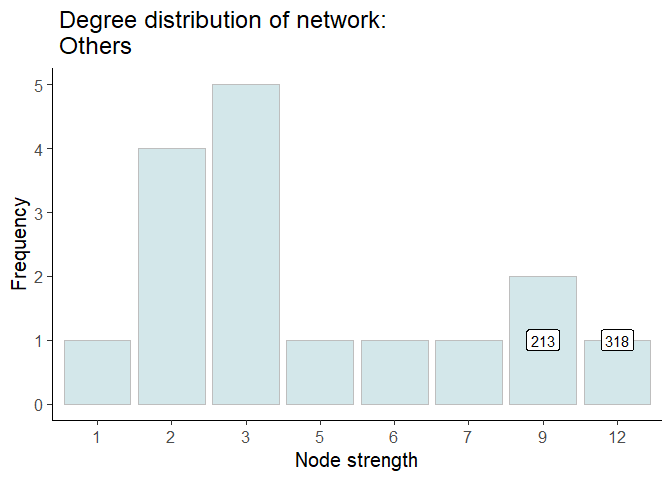
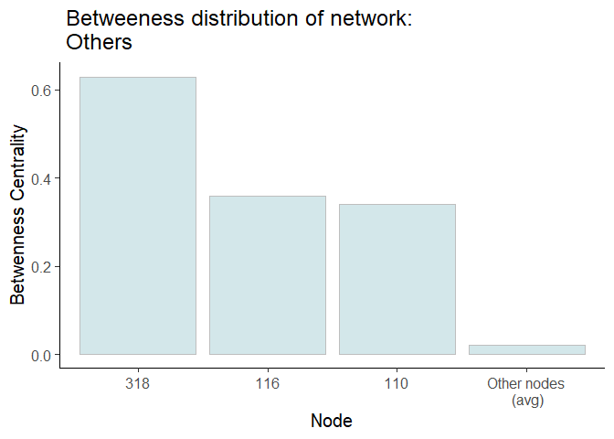
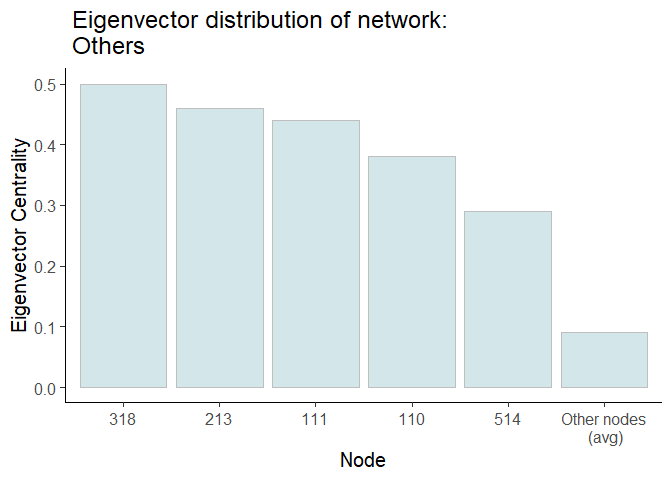
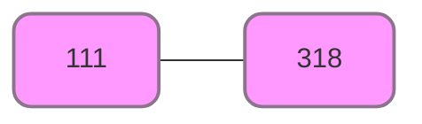

# Results & Disussion
Yann Cohen
2024-10-22

- [Pink network](#pink-network)
- [All network](#all-network)
- [Green network](#green-network)
- [Hetero network](#hetero-network)
- [Across networks](#across-networks)

In this file I will discuss interesting results from the different
networks.

# Pink network

This network has a total of 10 observations. It’s subject is
**Commitment to students and to some school**. It has 15 nodes and 34
edges. It is connected, meaning that from each node you can reach any
other node. The longest distance between two nodes is 3 (network’s
diameter) and the weighted sum of all edges is 41.

## Nodes

### Degree distribution

While most nodes have a degree of 3 (meaning 3 edges, or less if
weighted are connected to a node), some have larger degrees, as shown in
the histogram below.

We can see that node **111** has the highest degree of 16.

### Betweenness and Eigen centralities

The node with the highest betweenness centrality is **111** with a value
of 0.36.

The node with the highest eigen centrality is **111** with a value of
0.55.

Node 111 is clearly the most important node in the network.

## Edges

### Weights distribution

29 edges have a weight of 1. A few have larger weights, as shown in the
table below.

| Edge Weight |   N |
|------------:|----:|
|           1 |  29 |
|           2 |   3 |
|           3 |   2 |

Weights distribution in network: Commitment to students and to some
school

# All network

This network has a total of 35 observations. It’s subject is
**Commitment to students and to some school**. It has 30 nodes and 71
edges. It is not connected, meaning that from each node you can not
reach any other node. The longest distance between two nodes is 5 and
the weighted sum of all edges is 98.

## Nodes

### Degree distribution

While most nodes have a degree of 1 (meaning 1 edge is connected to a
node), some have larger degrees, as shown in the histogram below.

We can see that node **318** has the highest degree of 23.

### Betweenness and Eigen centralities

The node with the highest betweenness centrality is **510** with a value
of 0.27.

The node with the highest eigen centrality is **318** with a value of
0.47.

It is interesting that while node **510** doesn’t have lots of
connections (with a degree of 7), it has a high betweenness centrality
of 0.2733482. This means that it is a bridge between different parts of
the network.

## Edges

### Weights distribution

53 edges have a weight of 1. A few have larger weights, as shown in the
table below.

| Edge Weight |   N |
|------------:|----:|
|           1 |  53 |
|           2 |  12 |
|           3 |   4 |
|           4 |   1 |
|           5 |   1 |

Weights distribution in network: All items

# Green network

This network has a total of 9 observations. It’s subject is **Commitment
to students and to some school**. It has 20 nodes and 37 edges. It is
not connected, meaning that from each node you can not reach any other
node. The longest distance between two nodes is 2 and the weighted sum
of all edges is 39.

## Nodes

### Degree distribution

While most nodes have a degree of 4 (meaning 4 edge is connected to a
node), some have larger degrees, as shown in the histogram below.

We can see that node **318** has the highest degree of 11.

### Betweenness and Eigen centralities

The node with the highest betweenness centrality is **112** with a value
of 0.39.

The node with the highest eigen centrality is **318** with a value of
0.56.

It is interesting that while node **112** doesn’t have lots of
connections (with a degree of 3), it has a high betweenness centrality
of 0.3887497. This means that it is a bridge between different parts of
the network.

## Edges

### Weights distribution

36 edges have a weight of 1. A few have larger weights, as shown in the
table below.

| Edge Weight |   N |
|------------:|----:|
|           1 |  36 |
|           3 |   1 |

Weights distribution in network: Some teaching and educational
management

# Hetero network

This network has a total of 11 observations. It’s subject is
**Commitment to students and to some school**. It has 16 nodes and 30
edges. It is connected, meaning that from each node you can reach any
other node. The longest distance between two nodes is 1 and the weighted
sum of all edges is 36.

## Nodes

### Degree distribution

While most nodes have a degree of 3 (meaning 3 edge is connected to a
node), some have larger degrees, as shown in the histogram below.

We can see that node **318** has the highest degree of 12.

### Betweenness and Eigen centralities

The node with the highest betweenness centrality is **318** with a value
of 0.63.

The node with the highest eigen centrality is **318** with a value of
0.5.

Node 111 is clearly the most important node in the network.

## Edges

### Weights distribution

25 edges have a weight of 1. A few have larger weights, as shown in the
table below.

| Edge Weight |   N |
|------------:|----:|
|           1 |  25 |
|           2 |   4 |
|           3 |   1 |

Weights distribution in network: Others

# Across networks

The path between node **111** and **318** appears in all 4 networks. It
is the only path that exists in all four of them.

| network | path          | edge_weight |
|:--------|:--------------|------------:|
| all     | 111 \<-\> 318 |           5 |
| pinks   | 111 \<-\> 318 |           3 |
| greens  | 111 \<-\> 318 |           3 |
| hetero  | 111 \<-\> 318 |           3 |

*Edge weights for path 111 \<-\> 318 in all networks*
