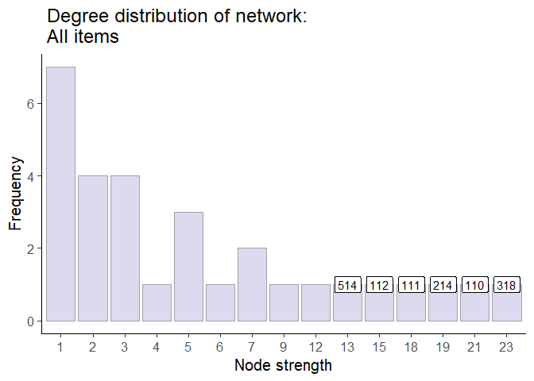

# Results & Disussion
Yann Cohen
2024-10-18

- [Pink network](#pink-network)
  - [Nodes](#nodes)
    - [Degree distribution](#degree-distribution)
    - [Betweenness and Eigen
      centralities](#betweenness-and-eigen-centralities)
  - [Edges](#edges)
    - [Weights distribution](#weights-distribution)
- [All network](#all-network)
  - [Nodes](#nodes-1)
    - [Degree distribution](#degree-distribution-1)
    - [Betweenness and Eigen
      centralities](#betweenness-and-eigen-centralities-1)
  - [Edges](#edges-1)
    - [Weights distribution](#weights-distribution-1)

In this file I will discuss interesting results from the different
networks.

# Pink network

This network has a total of 10 observations. It’s subject is
**Commitment to students and to some school**. It has 15 nodes and 34
edges. It is connected, meaning that from each node you can reach any
other node. The longest distance between two nodes is 3 (network’s
diameter) and the weighted sum of all edges is 41.

## Nodes

### Degree distribution

While most nodes have a degree of 3 (meaning 3 edges, or less if
weighted are connected to a node), some have larger degrees, as shown in
the histogram below.

We can see that node **111** has the highest degree of 16.

### Betweenness and Eigen centralities

The node with the highest betweenness centrality is **111** with a value
of 0.36.

The node with the highest eigen centrality is **111** with a value of
0.55.

Node 111 is clearly the most important node in the network.

## Edges

### Weights distribution

29 edges have a weight of 1. A few have larger weights, as shown in the
table below.

| Edge Weight |   N |
|------------:|----:|
|           1 |  29 |
|           2 |   3 |
|           3 |   2 |

Weights distribution in network: Commitment to students and to some
school

# All network

This network has a total of 35 observations. It’s subject is
**Commitment to students and to some school**. It has 30 nodes and 71
edges. It is not connected, meaning that from each node you can not
reach any other node. The longest distance between two nodes is 5 and
the weighted sum of all edges is 98.

## Nodes

### Degree distribution

While most nodes have a degree of 1 (meaning 1 edge is connected to a
node), some have larger degrees, as shown in the histogram below.

We can see that node **318** has the highest degree of 23.

### Betweenness and Eigen centralities

The node with the highest betweenness centrality is **510** with a value
of 0.27.

The node with the highest eigen centrality is **318** with a value of
0.47.

It is interesting that while node **510** doesn’t have lots of
connections (with a degree of 7), it has a high betweenness centrality
of 0.2733482. This means that it is a bridge between different parts of
the network.

## Edges

### Weights distribution

53 edges have a weight of 1. A few have larger weights, as shown in the
table below.

| Edge Weight |   N |
|------------:|----:|
|           1 |  53 |
|           2 |  12 |
|           3 |   4 |
|           4 |   1 |
|           5 |   1 |

Weights distribution in network: All items
